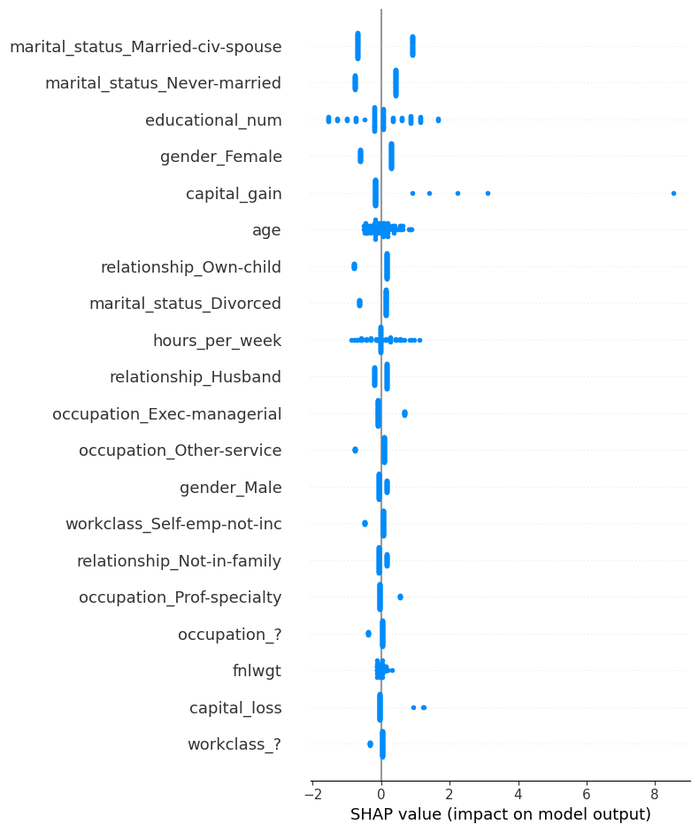
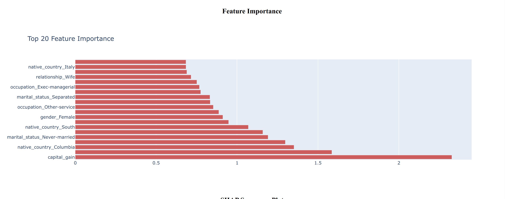

# 📊 UCIAdultXAI — Interactive Model Interpretation Dashboard

**UCIAdultXAI** is a production-ready, interactive dashboard for training, evaluating, and interpreting classification models (Logistic Regression, Random Forest, XGBoost, CatBoost) using SHAP and feature importance plots. It is designed for data scientists and business stakeholders to visualize model behavior and performance with ease.

---

## 🖼️ Project Overview

## 📊 Class-wise Metrics


## 🔥 SHAP Summary Plot



## 🧠 Feature Importance




* **Model Accuracy & Metrics**: Visualize class-wise precision, recall, and F1 score.
* **Top Feature Importances**: Sorted bar chart of the top 20 impactful features.
* **SHAP Summary Plot**: Explains global feature contributions via SHAP.

---

## 🚀 Features

* Supports 4 classification algorithms:

  * Logistic Regression
  * Random Forest
  * XGBoost
  * CatBoost
* Dynamic dropdown to toggle between models.
* SHAP summary visualization with `matplotlib`.
* Classification report parsing and rendering.
* FastAPI backend with an interactive Dash frontend.
* Dockerized with reproducible builds.

---

## 🧪 Tech Stack

* **Backend**: FastAPI, Scikit-learn, XGBoost, CatBoost
* **Visualization**: Dash by Plotly, SHAP
* **Deployment**: Docker & Docker Compose
* **Logging**: Custom structured logger
* **Dataset**: UCI Adult Income Dataset (binary classification)

---

## 🐳 Docker Setup

### Step 1: Clone the repo

```bash
git clone https://github.com/smasoudrezvani/UCIAdultXAI.git
cd ml-insighthub
```

### Step 2: Add dataset

Place your `adult.csv` file inside the `data/` directory.

### Step 3: Build and run the app

```bash
docker-compose up --build
```

### Step 4: Access the dashboard

Open your browser and navigate to:
👉 `http://172.0.0.1:5050/dashboard/`

---

## 📝 Project Structure

```bash
.
├── app/
│   ├── config.py
│   ├── data.py
│   ├── dashboard.py
│   ├── logger.py
│   ├── main.py
│   ├── model.py
│   ├── pipeline.py
│   └── data/adult.csv
├── Dockerfile
├── docker-compose.yml
├── requirements.txt
└── README.md
```

---

## 🛠️ Development

To run locally:

```bash
uvicorn app.main:app --reload --host 0.0.0.0 --port 5050
```

Then access the dashboard at [http://localhost:5050/dashboard](http://localhost:5050/dashboard)

---

## 📈 Example Output

* **Accuracy**: 0.8569 (Logistic), 0.8783 (XGBoost)
* **SHAP**: Highlights high-impact features like `capital_gain`, `age`, `relationship_*`
* **Feature Importance**: Consistently emphasizes `capital_gain`, `education`, `native_country`

---

## ✅ Requirements

* Python 3.8+
* See `requirements.txt` for all dependencies

---

## Contributing

Contributions are welcome! Please open an issue or submit a pull request for any improvements or bug fixes.

## License

This project is licensed under the Apache-2.0 license.
